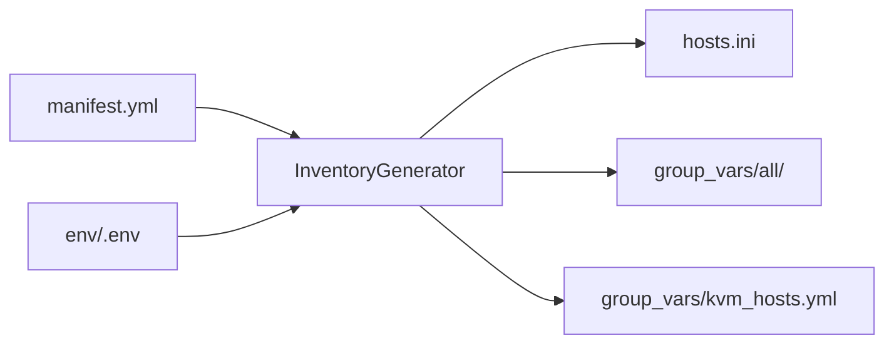

# `app/inventory/` — inventory generator

Python CLI behind `make inventory`. Reads [`provisioning/inventory/manifest.yml`](../provisioning/inventory/manifest.yml)
and optional `env/.env`, then writes per-overlay Ansible artifacts under
`provisioning/inventory/<overlay>/`.

Ansible inventory guide: [`provisioning/inventory/README.md`](../provisioning/inventory/README.md).

## Overview



| Input | Output (per overlay) |
|-------|----------------------|
| `manifest.yml` | `hosts.ini` with `[kvm_hosts]`, `[vms]`, `[vms:vars]` |
| `env/.env` overrides | Updated `vm_ip` / `vm_name` when `OVERLAY` matches |
| `_shared/group_vars/` | Symlinks `00_shared.yml`, `kvm_hosts.yml` |
| Overlay `role` + optional `vars` | `50_overlay.generated.yml` |

Manual `90_local.yml` files are never overwritten.

## Modules

| Module | Responsibility |
|--------|----------------|
| [`cli.py`](cli.py) | Entrypoint: `python -m app.inventory.cli` |
| [`models.py`](models.py) | Parse and validate manifest (`VmSpec`, `OverlaySpec`, `InventoryManifest`) |
| [`generator.py`](generator.py) | Render `hosts.ini`, write symlinks and generated group_vars |
| [`mac.py`](mac.py) | MAC `52:54:00:<md5(hostname)>` — same rule as Ansible role 00 |
| [`env_file.py`](env_file.py) | Minimal `.env` reader; `VM_NAME` / `VM_IP` / `OVERLAY` overrides |

## CLI

```bash
# all overlays (make inventory)
uv run python -m app.inventory.cli generate --all

# single overlay
uv run python -m app.inventory.cli generate -o broetec-core

# preview without writing files
uv run python -m app.inventory.cli generate -o broetec-core --dry-run

# list overlays
uv run python -m app.inventory.cli list

# show one overlay
uv run python -m app.inventory.cli show broetec-core
```

Make wrappers: `make inventory`, `make inventory OVERLAY=broetec-core` (`inventory-overlay`).

## Artifacts written (`_ensure_group_vars`)

For each `<overlay>/`:

```text
hosts.ini
group_vars/kvm_hosts.yml          → symlink _shared/group_vars/kvm_hosts.yml
group_vars/all/00_shared.yml      → symlink _shared/group_vars/all.yml
group_vars/all/50_overlay.generated.yml   (generated YAML)
group_vars/all/90_local.yml       (manual — not touched)
```

Legacy `group_vars` symlink layout is removed if present.

## env/.env overrides

Applied only when `OVERLAY` in `.env` matches the overlay being generated (or is unset):

| Key | Effect |
|-----|--------|
| `OVERLAY` | Selects default overlay for `generate` without `-o` / `--all` |
| `VM_NAME` | Replaces primary VM libvirt name |
| `VM_IP` | Replaces primary VM IP |
| `ANSIBLE_VM_CONNECTION` | `ssh` or `libssh` → `ansible_connection` in `[vms:vars]` |

## Extending

1. Add overlay block to `manifest.yml` (`label`, `role`, `vms`, optional `vars`).
2. Create overlay directory with `group_vars/all/90_local.yml` if needed.
3. Run `make inventory` or `generate --dry-run` to preview `hosts.ini`.
4. Use `vm_role` in conditional Ansible plays (see inventory README).

## Requirements

- Python 3.12+ (project venv via `uv sync`)
- PyYAML (project dependency)
- Writable `provisioning/inventory/<overlay>/`

## Troubleshooting

| Symptom | What to try |
|---------|-------------|
| `Repo root not found` | Run from repo tree containing `provisioning/inventory/manifest.yml` |
| `Unknown overlay` | Check overlay id in manifest; use `cli list` |
| Symlink errors on Windows/WSL | Generator expects POSIX symlinks; use Linux/macOS for inventory generation |
| Stale `hosts.ini` | Re-run `make inventory` after manifest or `.env` changes |
