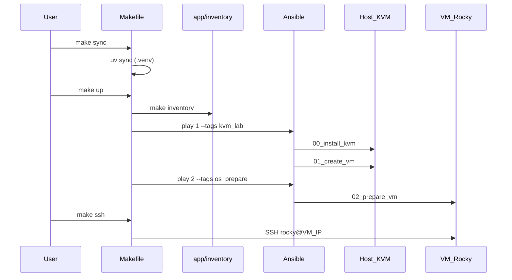

# Estrutura do projeto

Mapa de pastas do **k8s-blueprint** — laboratório de estudo para Ansible,
KVM/libvirt e Kubernetes.

← [Índice da documentação](index.md)

---

## Visão geral

```text
k8s-blueprint/
├── README.md                 # Entrada: quick start
├── Makefile                  # Orquestrador principal (make up, ssh, clean, …)
├── pyproject.toml            # Dependências Python (Ansible via uv)
├── uv.lock
│
├── app/                      # App Python
├── tests/                    # Testes do app/
│
├── provisioning/             # Todo o Ansible
│   ├── ansible.cfg
│   ├── site.yml
│   ├── collections/
│   ├── inventory/
│   ├── roles/
│   │   ├── 00_install_kvm/
│   │   ├── 01_create_vm/
│   │   └── 02_prepare_vm/
│   └── templates/
│
├── lab/                      # Artefactos locais KVM (conteúdo gitignored)
├── env/                      # Credenciais e .env local
├── k8s/                      # Manifests Kubernetes (futuro)
└── docs/                     # Documentação (futuro Sphinx)
```

---

## app

App Python do projeto. Hoje contém o **gerador de inventário Ansible**
(`app/inventory/`), invocado por `make inventory` via o script
`k8s-blueprint-inventory`.

| Conteúdo | Versionado |
|----------|------------|
| Código Python (`app/`) | Sim |
| `.venv/` | Não (gitignored; criado por `make sync`) |

**Futuro:** configs personalizadas do lab (topologia, overlays, parâmetros de VM)
geradas por CLI ou UI Python.

---

## provisioning

Toda a configuração **Ansible** do laboratório.

| Ficheiro / pasta | Função |
|------------------|--------|
| `ansible.cfg` | Timeouts, SSH, libssh (estabilidade no terminal) |
| `site.yml` | Playbook mestre — duas plays (KVM + preparação da VM) |
| `inventory/` | `manifest.yml` (fonte de verdade), overlays `broetec-*` |
| `roles/00_install_kvm/` | Bootstrap host, rede libvirt, firewalld/NAT |
| `roles/01_create_vm/` | qcow2, cloud-init, virt-install, wait SSH |
| `roles/02_prepare_vm/` | swap, SELinux, firewalld dentro da VM |
| `templates/cloud-init.j2` | user-data cloud-init por VM |
| `collections/requirements.yml` | Coleções Galaxy (`ansible.posix`, `ansible.netcommon`) |

Documentação detalhada: [provisioning/README.md](../provisioning/README.md).

**Nota:** o grupo de inventário `[kvm_hosts]` e variáveis como
`kvm_host_bootstrap` mantêm nomes técnicos Ansible; só as **pastas das roles**
usam a nomenclatura numerada.

---

## lab

Artefactos **gerados no disco** pelo `make up`. Descartáveis com `make clean`.

| Subpasta | Conteúdo | Versionado |
|----------|----------|------------|
| `disks/` | Discos qcow2 das VMs, seed ISOs cloud-init | Não |
| `cache/` | Imagem base Rocky Linux (download único) | Não |
| `README.md` | Documentação da pasta | Sim |

Documentação: [lab/README.md](../lab/README.md).

---

## env

Defaults e **credenciais locais** do laboratório.

| Ficheiro | Versionado | Função |
|----------|------------|--------|
| `.env.example` | Sim | Template de variáveis do Make |
| `README.md` | Sim | Documentação |
| `.env` | Não | Defaults locais (`OVERLAY`, `VM_IP`, …) |
| `k8s-blueprint` / `.pub` | Não | Chave SSH do lab (gerada por `make keys` / `make up`) |
| `become.pass` / `vm-become.pass` | Não | Passwords sudo opcionais |

Documentação: [env/README.md](../env/README.md).

---

## k8s

Reservado para **manifests Kubernetes** (RKE2, CNI, workloads). Ainda não
integrado no fluxo automatizado do `make up`.

Documentação: [k8s/README.md](../k8s/README.md) · guia manual:
[bootstrap/README.md](bootstrap/README.md).

---

## docs

Fonte da documentação do projeto, preparada para migração futura para
**Sphinx** (`docs/_build/` já está no `.gitignore`).

| Conteúdo | Descrição |
|----------|-----------|
| `index.md` | Índice / toctree |
| `structure.md` | Este ficheiro |
| `bootstrap/`, `fine-tuning/`, `upgrade/` | Guias Kubernetes |

---

## tests

Testes unitários do app Python (`pytest`). Correr com:

```bash
uv run pytest
```

---

## Fluxo `make up`



### Ordem das roles

1. **00_install_kvm** — no host físico (`kvm_hosts`): pacotes KVM (opcional),
   rede libvirt `broetec-lab`, firewalld/NAT
2. **01_create_vm** — no host físico: download/clonagem qcow2, cloud-init,
   `virt-install`, aguarda SSH
3. **02_prepare_vm** — dentro de cada VM (`vms`): cloud-init, swap, SELinux,
   firewalld

---

## Onde customizar

| Objetivo | Onde editar |
|----------|-------------|
| Topologia de VMs (nome, IP, overlay) | `provisioning/inventory/manifest.yml` → `make inventory` |
| Sobrescrever overlay ativo | `env/.env` (`OVERLAY`, `VM_NAME`, `VM_IP`) |
| Variáveis Ansible partilhadas | `provisioning/inventory/_shared/group_vars/` |
| Caminho dos discos | `env/.env` (`LAB_PATH`) ou `group_vars/all.yml` |
| Pular instalação de pacotes no host | `make up` (já usa `--skip-tags bootstrap`) ou `kvm_host_bootstrap: false` |

---

## Versionado vs gitignored

| Versionado | Gitignored (gerado/local) |
|------------|---------------------------|
| Código, playbooks, inventário base | `.venv/`, `lab/disks/`, `lab/cache/` |
| `env/.env.example`, `env/README.md` | `env/.env`, chaves SSH |
| Overlays `broetec-*` no inventário | `kubeconfig*`, `.ansible/` |

Ver [.gitignore](../.gitignore) para a lista completa.
