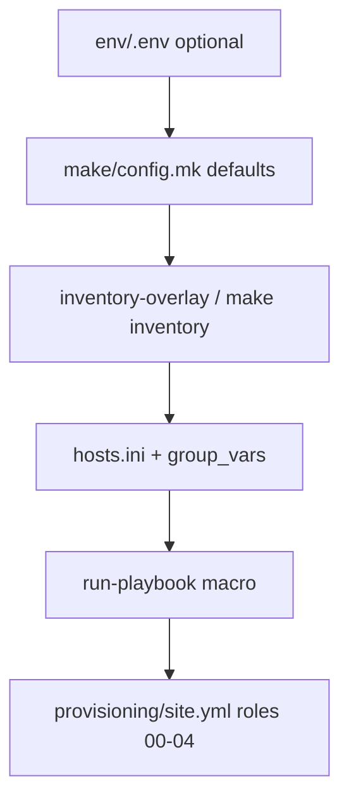

# `make/` — Makefile orchestration layer

> Repository map: [`docs/structure.md`](../docs/structure.md)

**Imperative** wrapper around the Ansible provisioning stack: loads `env/.env`,
generates inventory for the active overlay, invokes `uv run ansible-playbook`,
and exposes SSH/libvirt utilities for daily lab use.

```text
Makefile              # entry point — help + includes
├── make/config.mk    # defaults, env/.env, inventory-derived VM_* vars
├── make/colors.mk    # terminal colours (help, status messages)
├── make/ansible.mk   # run-playbook macro, setup-host tag/sudo logic
├── make/setup.mk     # sync, deps, keys, setup
├── make/inventory.mk # inventory, inventory-overlay
├── make/targets.mk   # setup-host, create-vm … up, up-all
└── make/ssh.mk       # SSH known_hosts, ssh, status, destroy, clean
```

## Documentation map

| Topic | Where to read |
|-------|---------------|
| Playbook, roles, tags | [`provisioning/README.md`](../provisioning/README.md), [`site.yml`](../provisioning/site.yml) |
| Inventory / manifest | [`provisioning/inventory/README.md`](../provisioning/inventory/README.md) |
| Inventory generator | [`app/inventory/README.md`](../app/inventory/README.md) |
| Local env keys | [`env/README.md`](../env/README.md), [`env/.env.example`](../env/.env.example) |
| Lab disk artifacts | [`lab/README.md`](../lab/README.md) |

---

## Position in the pipeline



| Make target | Ansible tags / role |
|-------------|---------------------|
| `setup-host` | `install_kvm` (+ `bootstrap` if `KVM_HOST_BOOTSTRAP=true`) |
| `create-vm` | `create_vm` → role **01** |
| `prepare-vm` | `prepare_vm` → role **02** |
| `install-rke2` | `install_rke2` → role **03** (stub) |
| `deploy-k8s` | `deploy_k8s` → role **04** (stub) |
| `deploy` | roles **03** + **04** |
| `up` | sub-makes: `create-vm` + `prepare-vm` + `deploy` |
| `up-all` | loop `up` over `LAB_OVERLAYS` |

Role **00** runs only via `make setup-host`, not `make up`.

---

## Quick start

```bash
cp env/.env.example env/.env   # optional local defaults

make sync
make setup-host                # once: controller + KVM host (role 00)
make up                        # broetec-core: VM + OS + k8s (01–04)
make ssh
make status
make destroy
make clean
```

Multi-VM lab:

```bash
make up-all                    # core + storage + monitor (3 VMs)
make up OVERLAY=broetec-storage
make deploy OVERLAY=broetec-core   # k8s only (03 + 04)
```

`make help` lists all targets and the current configuration.

---

## Make targets

### Setup (first run)

| Target | What it does |
|--------|--------------|
| `sync` | `uv sync` — create/update `.venv` from lock |
| `venv` | Alias for `sync` |
| `deps` | Verify `.venv`, `virsh`, `ssh-keygen`; install Galaxy collections |
| `keys` | Generate lab SSH key pair at `env/k8s-blueprint[.pub]` (idempotent) |
| `setup` | `sync` + `deps` + `keys` |
| `setup-host` | `setup` + `inventory-overlay` + role **00** on KVM host |

### Inventory

| Target | What it does |
|--------|--------------|
| `inventory` | Regenerate `hosts.ini` for **all** overlays |
| `inventory-overlay` | Regenerate `hosts.ini` for the active `OVERLAY` only |

Most playbook targets depend on `inventory-overlay` implicitly.

### Stages (roles 01–04)

| Target | Role | Notes |
|--------|------|-------|
| `create-vm` | **01** | qcow2, cloud-init seed ISO, `virt-install` |
| `prepare-vm` | **02** | Guest OS prep (swap, SELinux, firewalld) |
| `install-rke2` | **03** | RKE2 install (stub) |
| `deploy-k8s` | **04** | k8s manifests (stub) |
| `deploy` | **03** + **04** | Update k8s only on an existing VM |

### Lab flows

| Target | What it does |
|--------|--------------|
| `up` | `create-vm` → `prepare-vm` → `deploy` for active overlay |
| `up-all` | Run `up` for each overlay in `LAB_OVERLAYS` |

`up` uses `SUBMAKE` (not `$(MAKE)`) so recursive invocations work when the IDE
redefines `MAKE` to an AppImage.

### Operations

| Target | What it does |
|--------|--------------|
| `ssh` | SSH into the VM (`VM_USER@VM_IP` from inventory, lab private key) |
| `ssh-add-lab` | Add lab private key to `ssh-agent` |
| `status` | List libvirt domains and networks |
| `destroy` | Undefine VMs for active overlay; keep qcow2 cache |
| `clean` | `destroy` + remove libvirt network + `lab/` + lab SSH key |

### SSH helpers

| Target | What it does |
|--------|--------------|
| `ensure-user-known-hosts` | Prepare `~/.ssh/known_hosts`, `env/ssh_config_lab`, stub file |
| `ensure-ssh-global-known-hosts` | Create empty `/etc/ssh/ssh_known_hosts` when `CREATE_SSH_GLOBAL_KNOWN_HOSTS=true` |
| `ssh-host-key-forget` | Remove stale VM entries from `~/.ssh/known_hosts` |
| `ssh-host-key-refresh` | Poll `ssh-keyscan` and record VM host key before VM plays |

### Target dependencies (selected)

- `prepare-vm`, `install-rke2`, `deploy-k8s` → `ssh-host-key-refresh`
- `up` → `ensure-ssh-global-known-hosts` (no-op unless opt-in)
- `setup-host` → `ensure-user-known-hosts`
- Playbook targets → `inventory-overlay`, `deps`, `keys` (where applicable)

---

## Configuration

Copy `env/.env.example` → `env/.env` (gitignored). The Makefile loads it with
`-include`. Command-line overrides still win: `make up OVERLAY=broetec-storage`.

### User-facing variables

| Variable | Default | Used by | Notes |
|----------|---------|---------|-------|
| `OVERLAY` | `broetec-core` | All targets | Selects `INVENTORY` path |
| `VM_NAME`, `VM_IP`, `VM_USER` | Parsed from `hosts.ini` | `ssh`, `destroy`, key refresh | Fallbacks when inventory is missing |
| `KVM_NETWORK` | `broetec-lab` | `clean` | libvirt network name |
| `LAB_PATH` | `./lab` | Derived paths | Root for disk artifacts |
| `LAB_DISKS_PATH`, `LAB_CACHE_PATH` | `lab/disks`, `lab/cache` | `run-playbook`, `destroy`, `clean` | Passed as `-e lab_disks_path` / `lab_cache_dir` |
| `KVM_HOST_BOOTSTRAP` | `true` | `setup-host` | Host package install (role 00 bootstrap tag) |
| `KVM_HOST_FIREWALL` | `false` | `setup-host` | NAT/FORWARD rules on host |
| `ANSIBLE_FLAGS` | empty | All playbook targets | Extra flags appended to `ansible-playbook` |
| `EXTRA` | empty | All playbook targets | Third argument to `run-playbook` (extra `-e`, `--limit`, etc.) |
| `ANSIBLE_FORKS` | `1` | `run-playbook` | Stability in integrated terminals |
| `ANSIBLE_PRUNE_SSH_KNOWN_HOSTS` | `false` | `run-playbook` | Passed as extra-var to `site.yml` |
| `CREATE_SSH_GLOBAL_KNOWN_HOSTS` | `false` | `ensure-ssh-global-known-hosts` | Opt-in sudo on controller |
| `ANSIBLE_VM_CONNECTION` | — | **`make inventory` only** | Set in `env/.env` (`libssh` or `ssh`); generator reads the file, not Make CLI |
| `UV`, `UV_PYTHON` | `uv`, `3.12` | `sync`, all `uv run` | Override Python version via `env/.env` |

After changing `ANSIBLE_VM_CONNECTION`, run `make inventory` and re-run the playbook.

### Become passwords

| File | Used for |
|------|----------|
| `env/become.pass` | Host plays with sudo (`setup-host` when bootstrap or firewall runs) |
| `env/vm-become.pass` | VM plays (`prepare-vm`, `install-rke2`, `deploy-k8s`) |

Do **not** pass `--ask-become-pass` / `-K` on VM targets — use `env/vm-become.pass`
or `cloud_init.sudo_nopasswd: true` in inventory.

---

## Module reference

### [`config.mk`](config.mk)

Loads `env/.env`, defines overlay/inventory paths, parses `VM_*` from the active
`hosts.ini`, lab disk paths, become flags, KVM host toggles, and the
`ANSIBLE_FRONT` wrapper used by all Ansible invocations.

### [`colors.mk`](colors.mk)

Shared ANSI colour variables (`B`, `G`, `Y`, `R`, `N`) for `help` and status
output across setup, targets, and ssh modules.

### [`setup.mk`](setup.mk)

Controller bootstrap: `sync`, `venv`, `deps`, `keys`, `setup`, and the
`$(LAB_KEY).pub` pattern rule.

### [`inventory.mk`](inventory.mk)

Wraps `app.inventory.cli`: `inventory` (all overlays) and `inventory-overlay`
(active overlay).

### [`targets.mk`](targets.mk)

Playbook pipeline and lab flows: `setup-host`, stages **01–04**, `deploy`,
`up`, `up-all`. Uses `SUBMAKE` for recursive stage invocations.

### [`ansible.mk`](ansible.mk)

Defines `run-playbook` and `setup-host` logic:

- **`SETUP_HOST_TAGS`** — `install_kvm,bootstrap` when bootstrap is on; else `install_kvm` only
- **`SETUP_HOST_ANSIBLE_FLAGS`** — `--skip-tags bootstrap` when bootstrap is off
- **`SETUP_HOST_EXTRA`** — `-e kvm_host_bootstrap=` / `-e kvm_host_firewall=`
- **`SETUP_HOST_SUDO_FLAGS`** — host sudo only when bootstrap or firewall runs

### [`ssh.mk`](ssh.mk)

SSH known_hosts management, `make ssh`, libvirt `status` / `destroy` / `clean`.

### `run-playbook` macro

Single-line recipe shared by all playbook targets:

```makefile
$(ANSIBLE_FRONT) ansible-playbook --forks=$(ANSIBLE_FORKS) \
  -i $(INVENTORY) $(PLAYBOOK) --tags $(1) $(2) \
  --private-key=$(LAB_KEY_ABS) \
  -e ssh_public_key_path=$(LAB_KEY_ABS).pub \
  -e ansible_ssh_private_key_file=$(LAB_KEY_ABS) \
  -e ansible_prune_ssh_known_hosts=$(ANSIBLE_PRUNE_SSH_KNOWN_HOSTS) \
  $(ANSIBLE_LAB_EXTRA) $(3)
```

Arguments: `(tags, ansible_flags, extra_vars_and_limits)`.

---

## Troubleshooting

### `A worker was found in a dead state`

Ansible worker processes can fail in some environments (Cursor integrated
terminal, AppImage). Mitigations:

- Default `ANSIBLE_FORKS=1` and libssh connection (via generated inventory)
- Run `make up` in a terminal **outside** the IDE
- Try another Python: `make sync UV_PYTHON=3.13`
- Fallback: `ANSIBLE_VM_CONNECTION=ssh` in `env/.env`, then `make inventory`

See [`provisioning/README.md`](../provisioning/README.md) for full detail.

### Missing inventory / shared variables

After a fresh clone, run `make inventory` before playbook targets. Without
generated symlinks under `group_vars/all/`, Ansible may fail to resolve shared
variables.

### SSH host key / libssh warnings

Run `make setup-host` (or `make keys`) once for controller SSH stubs. VM plays
refresh the host key via `ssh-host-key-refresh`. Default
`ANSIBLE_PRUNE_SSH_KNOWN_HOSTS=false` avoids `site.yml` removing the key right
after refresh.

### VM plays ask for become password interactively

Create `env/vm-become.pass` or enable passwordless sudo in cloud-init
(`cloud_init.sudo_nopasswd: true` in `_shared/group_vars/all.yml`).

### `make inventory` did not pick up my connection override

`ANSIBLE_VM_CONNECTION` must be in **`env/.env`**, not only on the Make command
line. The Python generator reads the file directly.

---

## Advanced reference

### Internal Make variables

| Variable | Purpose |
|----------|---------|
| `ANSIBLE_FRONT` | `uv run` + `ANSIBLE_CONFIG` + private key env |
| `ANSIBLE_UNWRAP` | Strip problematic env vars before Ansible (IDE/AppImage) |
| `SUBMAKE` | `/usr/bin/make` or `/usr/bin/gmake` for recursive targets |
| `SETUP_HOST_*` | Computed in `ansible.mk` from `KVM_HOST_*` |

### Manual `ansible-playbook` equivalent

After `make sync`:

```bash
uv run ansible-playbook \
  -i provisioning/inventory/broetec-core/hosts.ini \
  provisioning/site.yml \
  --tags create_vm \
  --private-key env/k8s-blueprint
```

Use `uv run` at repo root so `provisioning/ansible.cfg` and the locked `.venv`
apply. See [`provisioning/README.md`](../provisioning/README.md) for bootstrap
skip and dry-run notes.

### Passing extra arguments

```bash
make create-vm EXTRA='--limit broetec-core'
make prepare-vm ANSIBLE_FLAGS='--check --diff'
make setup-host KVM_HOST_FIREWALL=true
```
