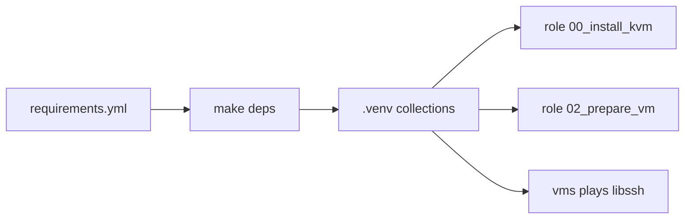

# `provisioning/collections/` — Ansible Galaxy dependencies

Galaxy collections required by this blueprint. They are **not** vendored in the repo;
`make deps` installs them into the project `.venv`.

## Position in the pipeline



| Make target | When collections are needed |
|-------------|----------------------------|
| `make deps` | Installs collections (run before first playbook) |
| `make setup-host` | `ansible.posix` — host firewalld/sysctl (role 00) |
| `make prepare-vm` | `ansible.posix` — VM firewalld (role 02) |
| `make up` | `ansible.netcommon` — libssh connection to VMs |

## Quick start

```bash
make sync    # project venv (uv)
make deps    # ansible-galaxy collection install -r provisioning/collections/requirements.yml
```

Re-run `make deps` after editing [`requirements.yml`](requirements.yml).

## Collections

| Collection | Consumer | Why |
|------------|----------|-----|
| `ansible.posix` | Roles **00**, **02** | `firewalld`, `sysctl` modules on host and inside VMs |
| `ansible.netcommon` | Generated inventory (`hosts.ini`) | `ansible.netcommon.libssh` connection plugin for VM plays |

Declared in [`requirements.yml`](requirements.yml). Role-level `dependencies` in `meta/main.yml`
do **not** replace this file — Galaxy collections belong here.

## Configuration

No collection-specific variables in this folder. Connection plugin settings for libssh
come from [`inventory/manifest.yml`](../inventory/manifest.yml) defaults and generated
`[vms:vars]` in `hosts.ini`.

Override VM transport in `env/.env`:

```bash
# fallback when libssh causes issues (uses system OpenSSH instead)
ANSIBLE_VM_CONNECTION=ssh
```

Then `make inventory` and re-run the playbook.

## Troubleshooting

| Symptom | What to try |
|---------|-------------|
| `couldn't resolve module/action 'ansible.posix.firewalld'` | Run `make deps`; confirm `.venv` is active via `make` / `uv run` |
| `libssh` / `ansible-pylibssh` import errors | `uv sync` then `make deps` |
| `worker dead` on VM plays with OpenSSH | Default is libssh; ensure `make deps` and regenerated `hosts.ini` |
| `worker dead` with libssh in integrated terminal | Set `ANSIBLE_VM_CONNECTION=ssh` in `env/.env`, `make inventory`, retry |
| Collection version drift | Re-run `make deps`; pin versions in `requirements.yml` if needed |

Host-side SSH settings (forks, pipelining): [`provisioning/ansible.cfg`](../ansible.cfg).

## Requirements

- `uv` and project venv (`make sync`)
- Ansible 2.14+ (see role `meta/main.yml` files)
- Network access to Galaxy on first `make deps`

## Advanced reference

Manual install:

```bash
uv run ansible-galaxy collection install -r provisioning/collections/requirements.yml
```

List installed collections:

```bash
uv run ansible-galaxy collection list
```
