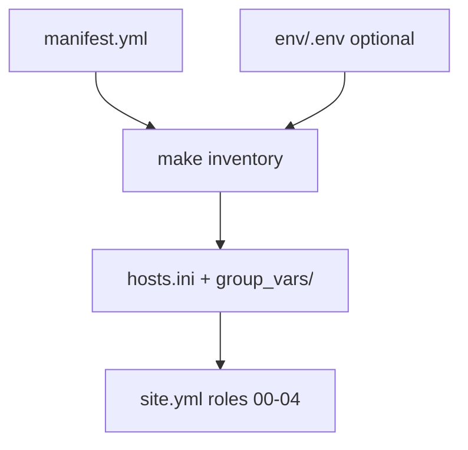

# Ansible inventory — Broetec overlays

Source of truth for lab VMs: [`manifest.yml`](manifest.yml) → `make inventory` →
`hosts.ini` and layered `group_vars/`. All overlays share
[`provisioning/site.yml`](../site.yml) and roles **00–04**.

Generator architecture: [`app/inventory/README.md`](../../app/inventory/README.md).

## Versioned overlays

| Overlay | VM (libvirt) | IP | Role (`vm_role`) |
|---------|--------------|-----|------------------|
| `broetec-core` | broetec-core | 10.20.30.40 | `core` |
| `broetec-storage` | broetec-storage | 10.20.30.50 | `storage` |
| `broetec-monitor` | broetec-monitor | 10.20.30.60 | `monitor` |

## Position in the pipeline



| Make target | Inventory step |
|-------------|----------------|
| `make inventory` | Regenerate all overlays |
| `make inventory OVERLAY=broetec-core` | Single overlay |
| `make setup-host` | Runs `inventory-overlay` first |
| `make up` | Runs `inventory-overlay` before playbook |

## First step after clone

A fresh clone **does not** include generated symlinks until you run inventory:

- `<overlay>/group_vars/all/00_shared.yml` → `_shared/group_vars/all.yml`
- `<overlay>/group_vars/kvm_hosts.yml` → `_shared/group_vars/kvm_hosts.yml`

```bash
make inventory
```

Without this, Ansible may fail to resolve shared variables.

## Variable layers (per overlay)

Each overlay has `group_vars/all/` merged in alphabetical order:

| File | Source | Purpose |
|------|--------|---------|
| `00_shared.yml` | symlink → `_shared/group_vars/all.yml` | Shared base (network, image, cloud-init) |
| `50_overlay.generated.yml` | **generated** (`make inventory`) | `vm_role`, `overlay_id`, manifest `vars` |
| `90_local.yml` | **versioned, manual** | Per-overlay overrides (disk, vCPUs, etc.) |

For group **`[kvm_hosts]`** only, the generator also creates:

| File | Source | Purpose |
|------|--------|---------|
| `group_vars/kvm_hosts.yml` | symlink → `_shared/group_vars/kvm_hosts.yml` | Controller Python (`.venv` via `ansible_playbook_python`) |

Edit **`manifest.yml`** for identity (IP, role, declarative vars) and **`90_local.yml`** for fine-tuning per overlay.

### Optional `become` on VMs

VM-only variables can live in `group_vars/vms.yml` (create manually per overlay; not generated).
Example: `ansible_become_password` when `cloud_init.sudo_nopasswd: false` — use gitignored
`env/vm-rocky.pass` or Ansible Vault; see [`provisioning/README.md`](../README.md).

## Generate `hosts.ini`

```bash
make inventory
# or one overlay:
make inventory OVERLAY=broetec-core
```

Do not edit `hosts.ini` by hand — it includes `vm_role` in `[vms:vars]` and libssh settings.

## `manifest.yml` schema

| Key | Required | Description |
|-----|----------|-------------|
| `defaults` | yes | Connection defaults for kvm host and VMs |
| `defaults.kvm_host` | yes | Inventory hostname for KVM plays (usually `localhost`) |
| `defaults.ansible_connection_vm` | yes | VM plugin (`ansible.netcommon.libssh` or `ssh`) |
| `overlays.<id>` | yes | One lab profile per overlay id |
| `overlays.<id>.role` | yes | Becomes `vm_role` in generated vars |
| `overlays.<id>.vms[]` | yes | At least one VM: `name`, `ip`, optional `mac` |
| `overlays.<id>.vars` | no | Extra keys merged into `50_overlay.generated.yml` |

Example overlay entry:

```yaml
overlays:
  broetec-core:
    label: Core node (control plane / lab reference)
    role: core
    vms:
      - name: broetec-core
        ip: 10.20.30.40
        # mac: "52:54:00:aa:bb:cc"  # optional; derived from name if omitted
```

## `90_local.yml` override examples

Per-overlay manual overrides (not overwritten by `make inventory`):

```yaml
# broetec-storage — larger disk for persistent data
vm_disk_size_gb: 120

# broetec-monitor — lighter telemetry node
vm_vcpus: 2
vm_memory_mb: 4096

# broetec-core — optional tuning (defaults from vm_defaults in all.yml)
# vm_vcpus: 4
# vm_memory_mb: 8192
# kvm_host_bootstrap: false
```

Full variable catalog: [`_shared/group_vars/all.yml`](_shared/group_vars/all.yml).

## Local overlay (gitignored)

```bash
# 1. Add entry in manifest.yml (in your fork) or copy a versioned overlay
cp -r broetec-core ../my-lab   # outside git — see .gitignore

# 2. Or override active overlay via env/.env only:
#    OVERLAY=broetec-core
#    VM_IP=10.20.30.45
make inventory
```

## Troubleshooting

### Wrong IP (e.g. 10.20.30.118 instead of .40)

Static IP comes from **`network-config` on the seed ISO** (cloud-init), rendered by
role **01** from `vm_ip` / `vm_mac` in inventory (`make inventory`).
If you changed IP or MAC in `manifest.yml` without recreating the VM, the guest may
keep the old address or fall back to the libvirt DHCP pool (`.100–.200`).

```bash
make inventory OVERLAY=broetec-core
make destroy OVERLAY=broetec-core    # or remove lab/disks/<vm>-seed.iso and the domain
make up OVERLAY=broetec-core
```

Verify MAC: `virsh dumpxml broetec-core | grep "mac address"` must match `vm_mac` in
`hosts.ini`. Verify IP in VM: `ip -4 addr show`.

See also [`templates/README.md`](../templates/README.md).

### No internet in VM (correct IP, ping 8.8.8.8 fails)

On hosts with **Docker** and an active firewall, `FORWARD` may block `vnet* → wlan0`.
Set `KVM_HOST_FIREWALL=true` in `env/.env` and run `make setup-host`
(role **00** detects firewalld, ufw, or iptables and applies NAT rules).

If the libvirt network exists but the VM still has no internet, confirm the guest IP
and re-run `make up OVERLAY=broetec-core` after fixing the host.

Test inside VM: `ping -c 2 8.8.8.8` and `curl -I http://example.com`.

## Full lab (3 VMs)

```bash
make up-all
```

Each overlay creates one VM on shared libvirt network `broetec-lab` (10.20.30.0/24).

## Future roles by `vm_role`

Use `vm_role` in conditional plays:

```yaml
- hosts: vms
  roles:
    - role: storage_setup
      when: vm_role == 'storage'
```
