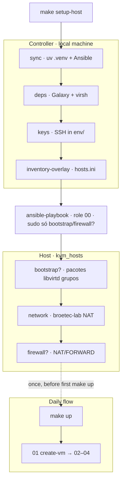

# `00_install_kvm` — prepare the KVM/libvirt host

Ansible role **00** in the k8s-blueprint lab pipeline. It prepares the physical
(or local) **KVM host** so [`01_create_vm`](../01_create_vm/) can provision VMs on a
shared libvirt NAT network.

Run **once** with `make setup-host`. It is **not** part of `make up` (daily flow).

## Position in the pipeline

`make setup-host` prepares the **controller** (Python/Ansible tooling on this machine) and
the **KVM host** (libvirt network and optional packages/firewall). `make up` assumes that
work is already done and only runs roles **01–04**.



`?` = skipped when the matching `KVM_HOST_*` flag in `env/.env` is `false` (see [Role steps](#role-steps-and-configuration)).


| Make target | What it runs |
|-------------|--------------|
| `make setup-host` | Controller chain above + role **00** (`KVM_HOST_*` in `env/.env`) |
| `make up` | Roles **01–04** on the active overlay (no role 00) |

## Quick start

```bash
cp env/.env.example env/.env
# Optional: KVM_HOST_BOOTSTRAP=false on immutable OS; KVM_HOST_FIREWALL=true if Docker + host firewall
make setup-host
# Re-login (nova sessão) para grupos libvirt/kvm — ver abaixo
make up
```

## Role steps and configuration

Copy [`env/.env.example`](../../../env/.env.example) to `env/.env`. The Makefile passes
`KVM_HOST_BOOTSTRAP` and `KVM_HOST_FIREWALL` into the playbook via
[`make/ansible.mk`](../../../make/ansible.mk) (tags, `--skip-tags`, and `-e` extra-vars).
Command-line overrides work the same: `make setup-host KVM_HOST_FIREWALL=true`.

| Step | Tasks | What it does on the KVM host | Control (`env/.env`) |
|------|-------|------------------------------|----------------------|
| **Bootstrap** | [`bootstrap.yml`](tasks/bootstrap.yml) | Installs `qemu-kvm`, libvirt, `virt-install`, and ISO tools; enables `libvirtd`; adds `kvm_host_libvirt_user` (default: `$USER`) to groups **`libvirt`** and **`kvm`**; on SELinux enforcing, registers `virt_image_t` for `lab/disks` and `lab/cache` (one-time). | `KVM_HOST_BOOTSTRAP=true` (default): tags `install_kvm,bootstrap`. `false`: skips bootstrap — use on immutable OS or when KVM is already installed. |
| **Network** | [`network.yml`](tasks/network.yml) | Creates or updates the shared NAT libvirt network (`broetec-lab`): bridge, gateway, single DHCP pool. Compares a SHA256 fingerprint before `net-define`; restarts only if logical XML changed. Runs **without sudo** when the operator is in group `libvirt` (active session). | Always runs (tag `install_kvm`). Not gated by `KVM_HOST_*`. |
| **Firewall** | [`firewall/`](tasks/firewall/) | Detects firewalld, ufw, or iptables (FORWARD DROP) and adds NAT/MASQUERADE plus FORWARD rules so traffic from lab `vnet*` interfaces can reach the internet through the host. | `KVM_HOST_FIREWALL=false` (default): entire block skipped. `true`: `-e kvm_host_firewall=true`; see [Host firewall](#host-firewall). |

Task YAML files include short header comments; see [`tasks/network.yml`](tasks/network.yml)
for fingerprint details.

Prefer `KVM_HOST_*` in `env/.env` over inventory overrides for bootstrap and firewall.

### `kvm_network` (inventory)

Defined in [`provisioning/inventory/_shared/group_vars/all.yml`](../../inventory/_shared/group_vars/all.yml),
not in this role:

| Field | Default | Role |
|-------|---------|------|
| `name` | `broetec-lab` | Shared libvirt network for all overlays |
| `bridge` | `virbr-broetec` | Host bridge |
| `gateway` | `10.20.30.1` | NAT gateway |
| `dhcp_start` / `dhcp_end` | `10.20.30.100`–`200` | Single DHCP pool on the virtual network |
| `subnet_cidr` | `10.20.30.0/24` | Lab subnet (firewall tasks) |
| `domain` | `{{ base_domain }}` | libvirt DNS domain |

## Libvirt network model

- One **persistent NAT network** (`broetec-lab`) shared by every overlay VM.
- Libvirt exposes a **single DHCP range** (`dhcp_start` … `dhcp_end`) on that network.
- **VM addresses are static inside the guest**: role `01_create_vm` writes `network-config`
  on the NoCloud seed ISO ([`provisioning/templates/network-config.j2`](../../templates/network-config.j2));
  lab VMs do not rely on libvirt DHCP for their final IP.

The subnet `10.20.30.0/24` is chosen to avoid collision with typical home routers
(`192.168.0.x` / `192.168.1.x`).

## Host firewall

Enable when the host runs an active firewall (often **Docker + firewalld/ufw**) and
lab VMs have the correct IP but **no internet** (`ping 8.8.8.8` fails). Set
`KVM_HOST_FIREWALL=true` in `env/.env` and run `make setup-host`.

When `kvm_host_firewall=true`, the role detects the backend (first match wins):

| Backend | When | Rules |
|---------|------|-------|
| firewalld | `systemctl is-active firewalld` == active | Zone `libvirt-routed`, masquerade, direct FORWARD + NAT |
| ufw | ufw service active and `ufw status` shows active | `before.rules` NAT/FORWARD block, `DEFAULT_FORWARD_POLICY=ACCEPT` |
| iptables | FORWARD chain policy is DROP | FORWARD accept + NAT MASQUERADE |
| none | No match | Debug message; no host changes |

Most hosts without an active firewall can leave `KVM_HOST_FIREWALL=false`.

## Host sem senha root (libvirt + kvm)

After the **first** `make setup-host` with bootstrap (default), daily host work runs
**without** host `sudo` when:

1. The operator is in groups **`libvirt`** and **`kvm`** (bootstrap adds both).
2. You opened a **new login session** after bootstrap (group membership is not
   active in the same shell until re-login).
3. `KVM_HOST_FIREWALL=false` (firewall tasks always use sudo).

| Command | Host sudo? |
|---------|------------|
| First `make setup-host` (bootstrap on) | **Yes** — packages, `libvirtd`, groups, SELinux lab paths |
| `make setup-host KVM_HOST_BOOTSTRAP=false KVM_HOST_FIREWALL=false` | **No** — `virsh` via Polkit + `libvirt` |
| `make up` / `create-vm` (play `[2/5]`) | **No** — `virsh`, `virt-install`, `lab/` owned by `kvm_host_libvirt_user` |
| `KVM_HOST_FIREWALL=true` | **Yes** — host firewall block |
| `make prepare-vm` (role 02) | Sudo **inside the VM** as `rocky` (default `sudo_nopasswd: true`) |

Role **01** needs **`kvm`** for `/dev/kvm`, not `libvirt` alone. Role **02** does not
use the host `libvirt` group — it SSHs to the VM.

## Immutable OS (Bazzite, Silverblue, Kinoite)

Do **not** install RPMs via Ansible on immutable hosts:

1. Set `KVM_HOST_BOOTSTRAP=false` in `env/.env`.
2. Install `qemu-kvm`, `libvirt`, `virt-install`, and ISO tools with `rpm-ostree` / distro docs.
3. Ensure `libvirtd` is running; add `$USER` to **`libvirt`** and **`kvm`**; re-login.
4. Run `make setup-host` (network and optional firewall).

## Idempotency

- **Bootstrap:** `package` and `service` modules report `ok` when already installed.
- **Network:** SHA256 fingerprint of logical XML (forward, bridge, domain, gateway, DHCP
  range) before `net-define`. Re-running `setup-host` does **not** restart the network
  unless that fingerprint changes.
- **Firewall:** Skipped when `kvm_host_firewall=false`; when on, backend checks (`-C`,
  `blockinfile` markers) avoid duplicate rules.

## Verification and troubleshooting

```bash
make setup-host

virsh -c qemu:///system net-list --all
virsh -c qemu:///system net-info broetec-lab
virsh -c qemu:///system net-dumpxml broetec-lab
systemctl is-active libvirtd
```

| Symptom | What to try |
|---------|----------------|
| `net-info broetec-lab` missing | Re-run `make setup-host`; check Ansible output for `net-define` / `net-start` |
| VM has correct IP, no outbound internet | `KVM_HOST_FIREWALL=true` + `make setup-host`; see [inventory README — no internet in VM](../../inventory/README.md) |
| `dnf` / RPM install fails on immutable OS | `KVM_HOST_BOOTSTRAP=false` and install packages manually |
| Missing `virsh` / `virt-install` after skipping bootstrap | Install host packages before `make up` |
| `virsh` / `virt-install`: permission denied | Re-login after bootstrap; confirm `groups` lists `libvirt` and `kvm` |
| `virt-install` SELinux error on `lab/disks` | Run bootstrap once (registers `virt_image_t`) or `semanage` manually |

## Requirements

- Inventory group **`kvm_hosts`** (typically `localhost`, `ansible_connection=local`)
- Play [`site.yml`](../../site.yml) uses **`become: false`**; sudo only inside bootstrap and firewall imports (`become: true` on those blocks)
- Collection **`ansible.posix`** (firewalld, sysctl)
- After bootstrap + re-login: `virsh`, `virt-install` on `PATH`; groups **`libvirt`** + **`kvm`**

## Advanced reference

### Tags

| Tag | Runs |
|-----|------|
| `install_kvm` | `network.yml`, `firewall/` (when enabled) |
| `bootstrap`, `install` | `bootstrap.yml` (packages + `libvirtd`) |

### Role variables (`defaults/main.yml`)

| Variable | Default | Meaning |
|----------|---------|---------|
| `kvm_host_bootstrap` | `true` | Run bootstrap tasks |
| `kvm_host_firewall` | `false` | Run host firewall tasks |
| `kvm_host_libvirt_user` | `$USER` | Account added to `libvirt` and `kvm` during bootstrap |

### Facts (internal)

| Fact | Set by | Used by |
|------|--------|---------|
| `kvm_libvirt_net_runtime_needs_refresh` | `network.yml` | Restart when logical XML changes |
| `kvm_firewall_backend` | `firewall/detect.yml` | Select firewalld, ufw, iptables, or none |

Per-VM MACs and `kvm_vm_mac_by_host` are set by **01_create_vm**, not this role.

### Manual playbook run

From [`provisioning/site.yml`](../../site.yml):

```yaml
- name: "[1/5] Preparar host KVM/libvirt"
  hosts: kvm_hosts
  become: false
  gather_facts: true
  tags:
    - install_kvm
  roles:
    - role: 00_install_kvm
```

```bash
uv run ansible-playbook \
  -i provisioning/inventory/broetec-core/hosts.ini \
  provisioning/site.yml \
  --tags install_kvm \
  --limit kvm_hosts \
  -e kvm_host_firewall=true
```
