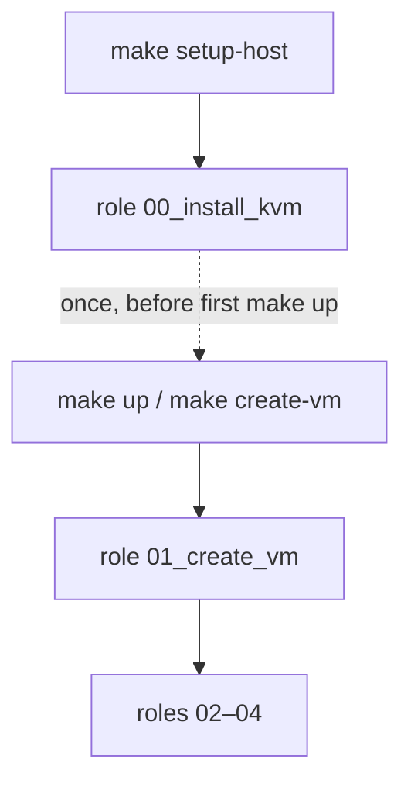

# `01_create_vm` — provision lab VMs on libvirt

Ansible role **01** in the k8s-blueprint lab pipeline. Clones the Rocky Linux cloud
image, builds NoCloud seed ISOs, and runs `virt-install` for each host in `groups['vms']`.

Requires role **00** (or equivalent host prep): NAT network `broetec-lab`, tools on `PATH`.

Part of `make up` (daily flow). Can also run alone with `make create-vm`.

## Position in the pipeline



| Make target | What it runs |
|-------------|--------------|
| `make setup-host` | Role **00** only (host KVM prep) |
| `make create-vm` | Role **01** on active overlay |
| `make up` | Roles **01–04** (no role 00) |

## Quick start

```bash
make keys
make inventory                    # hosts.ini with vm_ip + vm_mac per VM
make setup-host                   # role 00 (first time)
make create-vm OVERLAY=broetec-core
# or full pipeline:
make up OVERLAY=broetec-core
```

## What runs

Task YAML files include short header comments; see [`tasks/provision.yml`](tasks/provision.yml)
for the full create flow.

| Step | Tasks | What it does | Tag |
|------|-------|--------------|-----|
| **Preflight** | [`preflight.yml`](tasks/preflight.yml) | SSH public key exists; each VM has `vm_mac`; `virt-install` on PATH | `create_vm` |
| **Image cache** | [`image_cache.yml`](tasks/image_cache.yml) | Creates `lab/disks` and `lab/cache`; downloads Rocky qcow2 once | `create_vm` |
| **Provision** | [`provision.yml`](tasks/provision.yml) | Skips existing domains; clones disk; cloud-init seed ISO; `virt-install`; MAC assert | `create_vm` |
| **Wait SSH** | [`wait_ssh.yml`](tasks/wait_ssh.yml) | Polls port 22 on each `vm_ip` until cloud-init finishes | `create_vm` |

## Network model

- One shared libvirt NAT network (`broetec-lab`) from role **00**.
- **VM addresses are static inside the guest**: this role writes `network-config` on the
  NoCloud seed ISO ([`provisioning/templates/network-config.j2`](../../templates/network-config.j2));
  lab VMs do **not** rely on libvirt DHCP for their final IP.
- **`vm_mac`** in inventory (`make inventory`) is passed to `virt-install --mac` and matched
  in cloud-init so the correct NIC receives the static `vm_ip`.

## Host privileges

Play [`site.yml`](../../site.yml) runs this role with **`become: false`**. The operator needs:

- Group **`libvirt`** — `virsh -c qemu:///system`, `virt-install --connect qemu:///system`
- Group **`kvm`** — access to `/dev/kvm`
- **Active session** after bootstrap (re-login once; see [`00_install_kvm`](../00_install_kvm/README.md))
- Writable `lab/disks` and `lab/cache` (owned by `kvm_host_libvirt_user`, default `$USER`)

SELinux `virt_image_t` for lab paths is configured once in role **00** bootstrap.

## Configuration

### From inventory (`hosts.ini` + `group_vars`)

Per-VM fields in `hosts.ini` (generated by `make inventory`):

| Field | Example | Role |
|-------|---------|------|
| `vm_ip` | `10.20.30.40` | Static IP in cloud-init; Ansible `ansible_host` |
| `vm_mac` | `52:54:00:6d:81:73` | virt-install NIC + cloud-init `match.macaddress` |

Shared variables in [`provisioning/inventory/_shared/group_vars/all.yml`](../../inventory/_shared/group_vars/all.yml):

| Variable | Purpose |
|----------|---------|
| `vm_defaults` | vcpus, memory, disk size, os_variant, NIC model |
| `os_image` | Rocky qcow2 URL, filename, cache dir |
| `libvirt_pool` | Disk path under `lab/disks` |
| `kvm_network` | libvirt network name (`broetec-lab`) |
| `ssh_public_key_path` | Lab SSH key for cloud-init |
| `cloud_init` | User, timezone, authorized keys |

Per-host overrides in `hosts.ini`: `vm_vcpus`, `vm_memory_mb`, `vm_disk_size_gb`.

### Role variables (`defaults/main.yml`)

| Variable | Default | Meaning |
|----------|---------|---------|
| `create_vm_ssh_wait_delay` | `15` | Seconds before first SSH poll |
| `create_vm_ssh_wait_timeout` | `600` | Max seconds to wait for SSH per VM |

## Idempotency

- **Existing VMs:** `virsh dominfo` skips domains that already exist; only new hosts are provisioned.
- **Image download:** `get_url` with `force: false` — no re-download when cache file exists.
- **Disk clone:** `copy` with `force: false` — existing per-VM qcow2 is not overwritten.
- **Seed ISO:** Regenerated only for VMs in `vms_to_create`.

To change IP or MAC after first create: update manifest, `make inventory`, then
`make destroy && make up` (or remove VM + seed ISO manually).

## Verification and troubleshooting

```bash
make create-vm OVERLAY=broetec-core

virsh -c qemu:///system list --all
virsh -c qemu:///system dominfo broetec-core
virsh -c qemu:///system dumpxml broetec-core | grep "mac address"
ssh rocky@10.20.30.40
```

| Symptom | What to try |
|---------|-------------|
| SSH public key not found | `make keys` |
| Missing `vm_mac` on host | `make inventory` |
| `virt-install` not found | `make setup-host` (bootstrap) or install on immutable OS |
| Wrong IP on VM | Regenerate inventory; `make destroy && make up` |
| MAC mismatch assert | `make destroy && make up`; confirm `vm_mac` in hosts.ini |
| Permission denied on `virsh` | Re-login after bootstrap; confirm `libvirt` + `kvm` groups |

## Requirements

- Role **00** completed (or host with `broetec-lab` network and tools installed)
- Inventory group **`kvm_hosts`** and **`vms`** with `vm_ip` / `vm_mac`
- Play [`site.yml`](../../site.yml) tag **`create_vm`**, **`become: false`**
- Templates under [`provisioning/templates/`](../../templates/)

## Advanced reference

### Tags

| Tag | Runs |
|-----|------|
| `create_vm` | All task imports in this role |

### Manual playbook run

From [`provisioning/site.yml`](../../site.yml):

```yaml
- name: "[2/5] Create libvirt VMs"
  hosts: kvm_hosts
  become: false
  gather_facts: true
  tags:
    - create_vm
  roles:
    - role: 01_create_vm
```

```bash
uv run ansible-playbook \
  -i provisioning/inventory/broetec-core/hosts.ini \
  provisioning/site.yml \
  --tags create_vm \
  --limit kvm_hosts
```
