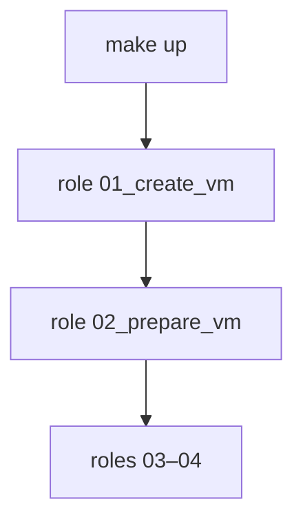

# `02_prepare_vm` — prepare Rocky Linux inside each VM

Ansible role **02** in the k8s-blueprint lab pipeline. Runs **inside each VM**
(`hosts: vms`) via SSH and leaves Rocky Linux in a baseline state for k8s:
swap off, SELinux enforcing, firewalld with ssh and ICMP.

Requires role **01** (VM exists and SSH responds). Does **not** install RKE2 or
cluster software — that is roles **03–04**.

Part of `make up`. Can also run alone with `make prepare-vm`.

## Position in the pipeline



| Make target | What it runs |
|-------------|--------------|
| `make create-vm` | Role **01** only |
| `make prepare-vm` | Role **02** on active overlay |
| `make up` | Roles **01–04** (prepare-vm after create-vm + ssh-host-key-refresh) |

## Quick start

```bash
make create-vm OVERLAY=broetec-core   # role 01 — VM + SSH
make ssh-host-key-refresh OVERLAY=broetec-core
make prepare-vm OVERLAY=broetec-core
# or full pipeline:
make up OVERLAY=broetec-core
```

## What runs

Task YAML files include short header comments; see [`tasks/firewalld.yml`](tasks/firewalld.yml)
for zone binding details.

| Step | Tasks | What it does | Tag |
|------|-------|--------------|-----|
| **Preflight** | [`preflight.yml`](tasks/preflight.yml) | `ping` without become; discover primary NIC | `prepare_vm` |
| **Cloud-init** | [`cloud_init.yml`](tasks/cloud_init.yml) | `cloud-init status --wait` | `prepare_vm` |
| **Swap** | [`swap.yml`](tasks/swap.yml) | `swapoff -a`; comment swap in `/etc/fstab` | `prepare_vm` |
| **SELinux** | [`selinux.yml`](tasks/selinux.yml) | `setenforce` at runtime; persist mode in config | `prepare_vm` |
| **Firewalld** | [`firewalld.yml`](tasks/firewalld.yml) | Install/start; default zone; bind NIC; ssh + icmp | `prepare_vm` |

Play [`site.yml`](../../site.yml) also runs a **pre_task** on localhost
(`ssh-keygen -R`) before this role — not part of the role itself.

## VM privileges

Play [`site.yml`](../../site.yml) runs this role with **`become: true`** on `hosts: vms`.

- First task uses **`become: false`** (`ping`) — avoids libssh/worker issues on some
  controllers (see [`provisioning/README.md`](../../README.md)).
- Subsequent tasks use sudo as `ansible_user` (default **`rocky`**).
- Passwordless sudo is configured by role **01** via cloud-init when
  `cloud_init.sudo_nopasswd: true` (default in inventory).

## Configuration

### Role variables (`defaults/main.yml`)

| Variable | Default | Meaning |
|----------|---------|---------|
| `prepare_vm_selinux_mode` | `enforcing` | Value written to `/etc/selinux/config`; runtime `setenforce 1` when enforcing |
| `prepare_vm_firewalld_zone` | `public` | Default zone; ssh and icmp rules target this zone |

### From inventory

Shared variables in [`provisioning/inventory/_shared/group_vars/all.yml`](../../inventory/_shared/group_vars/all.yml):

| Variable | Purpose |
|----------|---------|
| `cloud_init.default_user` | VM login user (`rocky`) |
| `cloud_init.sudo_nopasswd` | Ansible become without password |
| `ansible_user` | Set in `hosts.ini` `[vms:vars]` |

## Idempotency

- **Package/service:** `firewalld` install and enable report `ok` when already present.
- **Swap runtime:** `swapoff -a` runs every time; real effect only on first run with active swap.
- **Swap fstab:** `replace` only comments uncommented swap lines.
- **SELinux:** `lineinfile` idempotent for the same mode.
- **Firewalld:** `ansible.posix.firewalld` with `immediate: true` — no global reload
  that would drop SSH on the second run.
- **Default zone:** `firewall-cmd --set-default-zone` treats `ZONE_ALREADY_SET` as ok.

## Verification and troubleshooting

```bash
make prepare-vm OVERLAY=broetec-core

ssh rocky@10.20.30.40 free -h
ssh rocky@10.20.30.40 getenforce
ssh rocky@10.20.30.40 sudo firewall-cmd --list-all --zone=public
```

| Symptom | What to try |
|---------|-------------|
| Worker dies on first sudo / second play | Run `make up` outside the IDE terminal; see provisioning README |
| Correct IP but ping/SSH dead after prepare | NIC not in `public` zone — re-run role; check `firewalld.yml` interface bind |
| `cloud-init status --wait` hangs | VM still booting; wait or check role **01** wait_ssh timeouts |
| Become password prompt | Set `cloud_init.sudo_nopasswd: true` or provide `env/vm-become.pass` |

## Requirements

- Role **01** completed (VM reachable on SSH port 22)
- Inventory group **`vms`** with `ansible_host` / `vm_ip`
- Collection **`ansible.posix`** (firewalld module)
- Connection **`ansible.netcommon.libssh`** (default in generated inventory)
- Play tag **`prepare_vm`** in [`site.yml`](../../site.yml)

## Advanced reference

### Tags

| Tag | Runs |
|-----|------|
| `prepare_vm` | All task imports in this role |

### Facts (internal)

| Fact | Set by | Used by |
|------|--------|---------|
| `os_prepare_primary_iface` | `preflight.yml` | `firewalld.yml` — bind NIC to zone |

### Manual playbook run

From [`provisioning/site.yml`](../../site.yml):

```yaml
- name: "[3/5] Preparar SO das VMs"
  hosts: vms
  become: true
  gather_facts: false
  tags:
    - prepare_vm
  roles:
    - role: 02_prepare_vm
```

```bash
uv run ansible-playbook \
  -i provisioning/inventory/broetec-core/hosts.ini \
  provisioning/site.yml \
  --tags prepare_vm \
  --limit vms
```

## License

Apache-2.0 (see role metadata).
