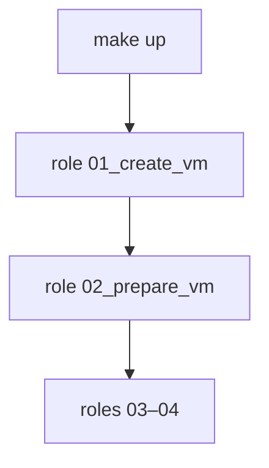

# `02_prepare_vm` — prepare Rocky Linux inside each VM

Ansible role **02** in the k8s-blueprint lab pipeline. Runs **inside each VM**
(`hosts: vms`) via SSH and leaves Rocky Linux in a baseline state for k8s:
swap off, SELinux enforcing, firewalld disabled, iptables tooling installed.

Requires role **01** (VM exists and SSH responds). Does **not** install RKE2 or
cluster software — that is roles **03–04**.

Part of `make up`. Can also run alone with `make prepare-vm`.

## Position in the pipeline


```mermaid
flowchart TB
  up["make up"]
  r01["role 01_create_vm"]
  r02["role 02_prepare_vm"]
  r03["roles 03–04"]

  up --> r01 --> r02 --> r03
```

| Make target | What it runs |
|-------------|--------------|
| `make create-vm` | Role **01** only |
| `make prepare-vm` | Role **02** on active overlay |
| `make up` | Roles **01–04** (prepare-vm after create-vm + ssh-host-key-refresh) |

## Quick start

```bash
make create-vm OVERLAY=broetec-core   # role 01 — VM + SSH
make ssh-host-key-refresh OVERLAY=broetec-core
make prepare-vm OVERLAY=broetec-core
# or full pipeline:
make up OVERLAY=broetec-core
```

## What runs

Task YAML files include short header comments; see [`tasks/iptables.yml`](tasks/iptables.yml)
for firewalld disable and package details.

| Step | Tasks | What it does | Tag |
|------|-------|--------------|-----|
| **Preflight** | [`preflight.yml`](tasks/preflight.yml) | `ping` without become; discover primary NIC | `prepare_vm` |
| **Cloud-init** | [`cloud_init.yml`](tasks/cloud_init.yml) | `cloud-init status --wait` | `prepare_vm` |
| **DNF bootstrap** | [`dnf.yml`](tasks/dnf.yml) | Tune `dnf.conf`, `dnf update`, reboot if needed, `epel-release` | `prepare_vm` |
| **Packages** | [`packages.yml`](tasks/packages.yml) | Auxiliary RPMs (`htop`, etc.; requires EPEL) | `prepare_vm` |
| **Swap** | [`swap.yml`](tasks/swap.yml) | `swapoff -a`; comment swap in `/etc/fstab` | `prepare_vm` |
| **SELinux** | [`selinux.yml`](tasks/selinux.yml) | `setenforce` at runtime; persist mode in config | `prepare_vm` |
| **Iptables** | [`iptables.yml`](tasks/iptables.yml) | Mask firewalld; install `iptables` + `iptables-nft` | `prepare_vm` |
| **Sysctl** | [`sysctl.yml`](tasks/sysctl.yml) | IP forwarding and inotify limits for k8s | `prepare_vm` |
| **QEMU GA** | [`qemu_guest_agent.yml`](tasks/qemu_guest_agent.yml) | Install qemu-guest-agent (opt-out) | `prepare_vm` |
| **Zsh** | [`zsh.yml`](tasks/zsh.yml) | zsh, Oh My Zsh, kubectx/kubens (opt-out) | `prepare_vm` |

Play [`site.yml`](../../site.yml) also runs a **pre_task** on localhost
(`ssh-keygen -R`) before this role — not part of the role itself.

## VM privileges

Play [`site.yml`](../../site.yml) runs this role with **`become: true`** on `hosts: vms`.

- First task uses **`become: false`** (`ping`) — avoids libssh/worker issues on some
  controllers (see [`provisioning/README.md`](../../README.md)).
- Subsequent tasks use sudo as `ansible_user` (default **`rocky`**).
- Passwordless sudo is configured by role **01** via cloud-init when
  `cloud_init.sudo_nopasswd: true` (default in inventory).

## Configuration

### Role variables (`defaults/main.yml`)

| Variable | Default | Meaning |
|----------|---------|---------|
| `prepare_vm_selinux_mode` | `enforcing` | Value written to `/etc/selinux/config`; runtime `setenforce 1` when enforcing |
| `prepare_vm_dnf_max_parallel_downloads` | `10` | Written to `/etc/dnf/dnf.conf` |
| `prepare_vm_dnf_update` | `true` | Run `dnf update` before other package installs |
| `prepare_vm_reboot_after_update` | `true` | Reboot when `needs-restarting -r` reports kernel/lib updates |
| `prepare_vm_epel` | `true` | Install `epel-release` (required for `htop` on Rocky 10) |
| `prepare_vm_packages` | `[htop]` | Auxiliary RPMs for VM day-to-day use; empty list skips install |
| `prepare_vm_qemu_guest_agent` | `true` | Install and enable qemu-guest-agent |
| `prepare_vm_zsh` | `true` | Install zsh, Oh My Zsh and kubectx/kubens |
| `prepare_vm_sysctl_settings` | see defaults | Kernel tuning written to `/etc/sysctl.d/90-k8s.conf` |

### From inventory

Shared variables in [`provisioning/inventory/_shared/group_vars/all.yml`](../../inventory/_shared/group_vars/all.yml):

| Variable | Purpose |
|----------|---------|
| `cloud_init.default_user` | VM login user (`rocky`) |
| `cloud_init.sudo_nopasswd` | Ansible become without password |
| `ansible_user` | Set in `hosts.ini` `[vms:vars]` |

## Idempotency

- **DNF conf:** `lineinfile` idempotent for `fastestmirror` and `max_parallel_downloads`.
- **DNF update:** `dnf` reports `ok` when packages are already latest.
- **Reboot:** skipped when `needs-restarting -r` returns 0.
- **EPEL / auxiliary packages:** `dnf` reports `ok` when already installed.
- **Firewalld:** `service` with `masked: true` reports `ok` when already masked.
- **Swap runtime:** `swapoff -a` runs every time; real effect only on first run with active swap.
- **Swap fstab:** `replace` only comments uncommented swap lines.
- **SELinux:** `lineinfile` idempotent for the same mode.
- **Sysctl:** `ansible.posix.sysctl` idempotent per key in `/etc/sysctl.d/90-k8s.conf`.

## Verification and troubleshooting

```bash
make prepare-vm OVERLAY=broetec-core

ssh rocky@10.20.30.40 grep -E 'fastestmirror|max_parallel' /etc/dnf/dnf.conf
ssh rocky@10.20.30.40 rpm -q epel-release htop
ssh rocky@10.20.30.40 uname -r
ssh rocky@10.20.30.40 free -h
```

| Symptom | What to try |
|---------|-------------|
| `htop` / package not found | Ensure `prepare_vm_epel: true`; EPEL must be enabled before auxiliary packages |
| Slow or hanging `dnf` metadata | Ensure `fastestmirror=True` in `/etc/dnf/dnf.conf`; Rocky Mirror Manager picks localized mirrors |
| Worker dies on first sudo / second play | Run `make up` outside the IDE terminal; see provisioning README |
| `cloud-init status --wait` hangs | VM still booting; wait or check role **01** wait_ssh timeouts |
| Become password prompt | Set `cloud_init.sudo_nopasswd: true` or provide `env/vm-become.pass` |
| firewalld still active after prepare | Re-run role; check `iptables.yml` service task |

## Requirements

- Role **01** completed (VM reachable on SSH port 22)
- Inventory group **`vms`** with `ansible_host` / `vm_ip`
- Collection **`ansible.posix`** (sysctl module)
- Connection **`ansible.netcommon.libssh`** (default in generated inventory)
- Play tag **`prepare_vm`** in [`site.yml`](../../site.yml)

## Advanced reference

### Tags

| Tag | Runs |
|-----|------|
| `prepare_vm` | All task imports in this role |

### Facts (internal)

| Fact | Set by | Used by |
|------|--------|---------|
| `os_prepare_primary_iface` | `preflight.yml` | Reserved for troubleshooting |

### Manual playbook run

From [`provisioning/site.yml`](../../site.yml):

```yaml
- name: "[3/5] Prepare guest OS"
  hosts: vms
  become: true
  gather_facts: false
  tags:
    - prepare_vm
  roles:
    - role: 02_prepare_vm
```

```bash
uv run ansible-playbook \
  -i provisioning/inventory/broetec-core/hosts.ini \
  provisioning/site.yml \
  --tags prepare_vm \
  --limit vms
```

## License

Apache-2.0 (see role metadata).
