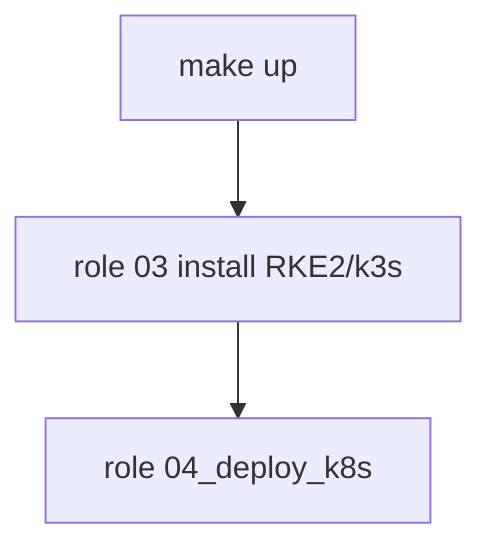

# `04_deploy_k8s` — Kubernetes bootstrap (RKE2 + k3s)

Ansible role **04** in the k8s-blueprint lab pipeline. Applies the cluster-wide
baseline after install (role **03**), common to both RKE2 and k3s: Cilium +
PriorityClasses, optional Sealed Secrets (BYOK), cert-manager and Argo CD.

**Prerequisite:** cluster already installed and reachable (`kubectl` working on
the VM or via workstation).

Part of `make up`. Can also run alone with `make deploy-k8s`.

## Position in the pipeline



| Make target | What it runs |
|-------------|--------------|
| `make deploy-k8s` | Role **04** only |
| `make deploy` | Roles **03–04** (refresh k8s without recreating the VM) |
| `make up` | Roles **01–04** (full pipeline) |

## Quick start

```bash
make deploy-k8s OVERLAY=broetec-core                     # without Sealed Secrets
make deploy-k8s OVERLAY=broetec-core SEALED_SECRETS=true # with Sealed Secrets (BYOK)
# or full pipeline:
make up OVERLAY=broetec-core
```

Steps 3.0–3.3 below are executed automatically by this role. The sections that
follow remain as a manual reference.

## Pipeline (`tasks/`)

| Step | Tasks | What it does | Tag |
|------|-------|--------------|-----|
| **Seal (offline)** | [`seal.yml`](tasks/seal.yml) | When `sealed_secrets_enabled`: generate/reuse BYOK keypair (`k8s-blueprint-seal genkey`) in `env/<overlay>/` and seal `*-secret.yaml` into `*-sealedsecret.yaml` on the controller (no `kubeseal`) | `deploy_k8s`, `sealed_secrets` |
| **Sync** | [`sync.yml`](tasks/sync.yml) | Copy `k8s/` to the VM (`~/<deploy_k8s_remote_dir>`); verify `helm`/`kubectl` exist (installed by role 02 `k8s_tools.yml`) | `deploy_k8s` |
| **Cluster config** | [`cluster_config.yml`](tasks/cluster_config.yml) | `kubectl apply --server-side -k cluster-config/overlays/<overlay>` (Cilium + PriorityClasses) | `deploy_k8s`, `cluster_config` |
| **Sealed Secrets** | [`sealed_secrets.yml`](tasks/sealed_secrets.yml) | Pre-apply BYOK key (label `sealedsecrets.bitnami.com/sealed-secrets-key=active`) **before** controller `helm install`, which then adopts it | `deploy_k8s`, `sealed_secrets` |
| **cert-manager** | [`cert_manager.yml`](tasks/cert_manager.yml) | Helm + ClusterIssuers (self-signed always; DNS-01 Cloudflare when token present) | `deploy_k8s`, `cert_manager` |
| **Argo CD** | [`argocd.yml`](tasks/argocd.yml) | Helm; admin password via Helm values (default) or SealedSecret | `deploy_k8s`, `argocd` |

Sealing runs on the controller (`delegate_to: localhost`) so the keypair and
SealedSecrets are produced offline before the cluster is touched. `helm` and
`kubectl` run on the VM as the connecting user (`become: false`).

## Key variables (`defaults/main.yml`)

| Variable | Default | Description |
|---|---|---|
| `deploy_k8s_enabled` | `true` | Master switch for the whole role |
| `deploy_k8s_overlay` | `{{ inventory_hostname }}` | k8s overlay name (e.g. `broetec-core`) |
| `deploy_k8s_remote_dir` | `manifests/k8s-blueprint` | Directory on the VM where `k8s/` is synced |
| `deploy_k8s_repo_root` | `{{ playbook_dir \| dirname }}` | Repo root on the controller (offline sealing) |
| `sealed_secrets_enabled` | `false` | Enable BYOK Sealed Secrets (`SEALED_SECRETS=true`) |
| `sealed_secrets_keydir` | `env/{{ deploy_k8s_overlay }}` | BYOK keypair location (relative to repo root) |
| `sealed_secrets_chart_version` | `2.18.3` | Sealed Secrets Helm chart version |
| `cert_manager_chart_version` | `v1.19.3` | cert-manager Helm chart version |
| `argocd_chart_version` | `9.4.10` | Argo CD Helm chart version |

See [`defaults/main.yml`](defaults/main.yml) for repo URLs and namespace names.

## Sealed Secrets (optional, BYOK)

When `sealed_secrets_enabled` is `true` (or `SEALED_SECRETS=true` via Make):

1. The role generates the key **locally** with `k8s-blueprint-seal genkey` in
   `env/<overlay>/`.
2. Plain Secrets are sealed offline (`k8s-blueprint-seal seal`, no `kubeseal`).
3. The controller key is pre-applied (label `active`) **before** `helm install`.
4. The controller adopts that key on startup.

When reinstalling the controller (cluster migration / DR), restore the **original
master key** before applying `SealedSecret`; otherwise a new key is generated and
old secrets cannot be decrypted. Apply the backup (`kubectl apply -f master.key`)
and, if needed, restart controller pods to reload the restored key.

## Manual reference

Use these commands when bootstrapping outside Ansible or for troubleshooting.
Replace `<environment_overlay>` with your overlay (e.g. `broetec-core`).

### 3.0 Apply base Cilium config (PriorityClasses + Cilium)

```bash
kubectl apply --server-side -k k8s/cluster-config/overlays/<environment_overlay>
```

### 3.1 Install Sealed Secrets (Helm) — before Argo CD

Manual bootstrap; after Argo CD deploy (step 3.3), the `sealed-secrets`
Application takes over the release (sync/upgrades).

```bash
helm repo add sealed-secrets https://bitnami-labs.github.io/sealed-secrets
helm repo update
helm upgrade --install sealed-secrets sealed-secrets/sealed-secrets \
  --namespace sealed-secrets \
  --create-namespace \
  --version 2.18.3 \
  -f k8s/sealed-secrets/base/values.yaml \
  -f k8s/sealed-secrets/overlays/<environment_overlay>/values.yaml
```

### 3.2 Install cert-manager (Helm) — before Argo CD

Manual bootstrap; after Argo CD deploy, the `cert-manager` Application takes
over the release (sync/upgrades).

```bash
helm repo add cert-manager https://charts.jetstack.io
helm repo update
helm upgrade --install cert-manager cert-manager/cert-manager \
  --namespace cert-manager \
  --create-namespace \
  --version v1.19.3 \
  -f k8s/cert-manager/base/values.yaml \
  -f k8s/cert-manager/overlays/<environment_overlay>/values.yaml

kubectl apply -k k8s/cert-manager/overlays/<environment_overlay>
```

### 3.3 Install Argo CD (Helm) — bootstrap

Manual bootstrap; after the first sync, the `argocd` Application takes over the
release (sync/upgrades). Use release name `argocd` to avoid a duplicate Argo CD
install.

```bash
helm repo add argo https://argoproj.github.io/argo-helm
helm repo update
helm upgrade --install argocd argo/argo-cd \
  --namespace argocd \
  --create-namespace \
  --version 9.4.10 \
  -f k8s/argocd/base/values.yaml \
  -f k8s/argocd/overlays/<environment_overlay>/values.yaml

kubectl apply -k k8s/argocd/overlays/<environment_overlay>
```

## Tags

| Tag | What it runs |
|---|---|
| `deploy_k8s` | All task imports in this role |
| `cluster_config` | Cilium + PriorityClasses only |
| `sealed_secrets` | Offline sealing + controller install |
| `cert_manager` | cert-manager Helm + ClusterIssuers |
| `argocd` | Argo CD Helm + overlay manifests |

## Manifests

Kubernetes manifests live under [`k8s/`](../../../k8s/).

## Troubleshooting

If Cilium does not apply changes automatically, force a restart of the operator:

```bash
kubectl rollout restart deployment -n kube-system cilium-operator
```

## Reference

- [k8s/ manifests](../../../k8s/README.md)
- [Sealed Secrets](https://github.com/bitnami-labs/sealed-secrets)
- [cert-manager](https://cert-manager.io/docs/)
- [Argo CD](https://argo-cd.readthedocs.io/)
