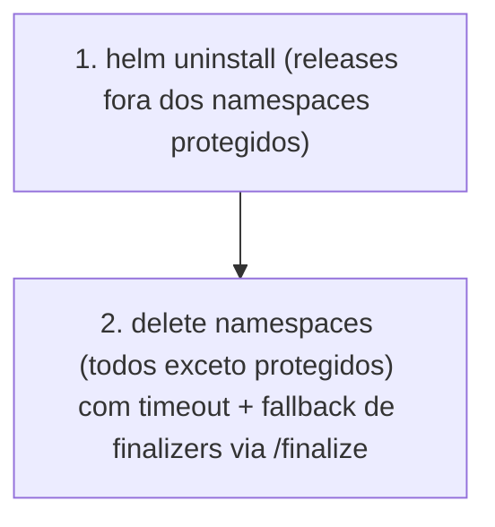

# `reset_k8s` — Teardown dos workloads (sem desinstalar o cluster)

Role utilitário (destrutivo, opt-in) que remove **todos** os namespaces e
releases Helm **exceto os protegidos**, **sem** desinstalar o cluster e **sem**
tocar no CNI core (`kube-system`) nem nas CRDs.

A lógica é uma *deny-list* (lista do que NÃO apagar), não uma allow-list dos
namespaces a apagar — assim o projeto pode crescer (mais apps/namespaces via
Argo CD) sem manter uma lista dos namespaces de aplicação.

Depois do reset, `make deploy-k8s` volta a fazer o bootstrap do cluster do zero.

**Invocação:** `make reset-k8s` (depois `make deploy-k8s`, ou `make redeploy-k8s`).

## O que é removido

| Recurso | Como |
|---------|------|
| Releases Helm | `helm list -A` → `helm uninstall` de cada release **fora** dos namespaces protegidos (remove ClusterRoles/webhooks que a release possui; as CRDs ficam) |
| Namespaces | `kubectl get ns` → apaga todos **exceto** `reset_k8s_protected_namespaces` |

## O que é preservado (lista protegida)

`reset_k8s_protected_namespaces` (em [`defaults/main.yml`](defaults/main.yml)):

- `kube-system` — CNI core (Cilium no rke2; flannel no k3s), CoreDNS,
  metrics-server e o **local-path embutido do k3s**.
- `kube-public`, `kube-node-lease`, `default`.

Também preservados: o serviço `rke2-server` / `k3s` (o cluster continua a correr)
e as CRDs (cert-manager, Argo CD, Gateway API) — evita os piores hangs de
finalizers e mantém a base.

> Para proteger mais algum namespace de base no futuro, basta acrescentá-lo a
> `reset_k8s_protected_namespaces`. Releases Helm que vivam num namespace
> protegido também nunca são desinstaladas (ex.: charts geridos pelo rke2 em
> `kube-system`).

## Ordem do teardown (evita travar em `Terminating`)

Quando um namespace fica preso em `Terminating`, o role limpa `spec.finalizers`
pelo subrecurso `/finalize`
([`tasks/namespace_teardown.yml`](tasks/namespace_teardown.yml)).

## Variáveis (`defaults/main.yml`)

| Variável | Default | Descrição |
|---|---|---|
| `reset_k8s_protected_namespaces` | kube-system, kube-public, kube-node-lease, default | Namespaces nunca apagados |
| `reset_k8s_ns_delete_timeout` | `60s` | Timeout antes do fallback de finalizers |
| `reset_k8s_kube_path` | `/var/lib/rancher/rke2/bin:...` | PATH para kubectl/helm na VM |

## Aviso

Operação **destrutiva**. Apaga todos os namespaces de aplicação e respetivos
PVCs/PVs. Os dados em `/opt/local-path-provisioner` no nó (rke2) permanecem como
diretórios órfãos.
